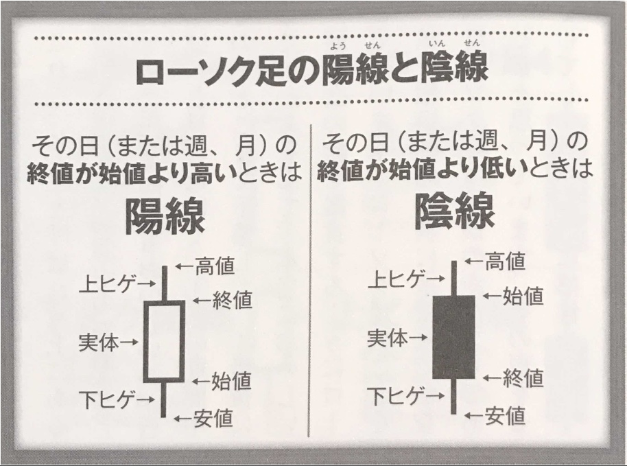

# Fintech関連の情報集約
FinTech関連の情報を集約するために使用するリポジトリ。
Key Quiestionを中心に、文献から情報を収集

文献のフォルダには、サンプルコードを保存するという感じで使用するつもり。
そうすると、分散しなくて良いかなと思うので。

<!-- @import "[TOC]" {cmd="toc" depthFrom=1 depthTo=6 orderedList=false} -->

<!-- code_chunk_output -->

# Fintech本

- [Pythonによるファイナンス第2版](https://www.dropbox.com/scl/fi/fi9emckn1dahkpzuu4sfq/Python-2.pdf?rlkey=rabm4oqkobvysz7sa0uzkrto4&dl=0)

  

  
メモ

  - [あんなメモ](/books/fintech/Pythonによるファイナンス第2版/memo.md)
  - [こんなメモ](/books/fintech/Pythonによるファイナンス第2版/konna.md)

  

# Programming

- [Create_GUI_Applications_with_PySide6](https://www.dropbox.com/scl/fi/z3q50qqkxktzblc8o2mqt/create-gui-applications-pyside6.pdf?rlkey=dl9bxumyfspu5pap82fe5sitj&dl=0)

  

  
メモ

  - [あんなメモ](/books/fintech/Pythonによるファイナンス第2版/memo.md)
  - [こんなメモ](/books/fintech/Pythonによるファイナンス第2版/konna.md)

  

- 生産性向上

  - [思考の整理学](None)

    

    
メモ

    - [朝飯前](/books/self_enlightenment/思考の整理学/朝飯前.md)
    - 

    

  - [超記憶](None)

    

    
メモ

    - [本](/books/self_enlightenment/chouKioku/choKioku.md)
    - [なにかのメモ](/books/self_enlightenment/chouKioku/kioku.md)

    

===
ひながた

- [書名](リンク)

  

  
メモ

  - 
  - 

  

===
以下、未整理

- [Fintech関連の情報集約](#fintech関連の情報集約)
- [日々の雑感](#日々の雑感)
  - [2021.11.7](#2021117)
- [Key Question](#key-question)
  - [そもそも対象とする株式はどうする？](#そもそも対象とする株式はどうする)
    - [日本株](#日本株)
    - [米国株](#米国株)
  - [メインチャートの表示パラメータの決定](#メインチャートの表示パラメータの決定)
    - [一生モノの株のトリセツ](#一生モノの株のトリセツ)
- [以下リソース](#以下リソース)
  - [一生モノの株のトリセツ](#一生モノの株のトリセツ-1)
    - [一粒で４度美味しいローソク足（p.33）](#一粒で4度美味しいローソク足p33)
  - [移動平均線究極の読み方・使い方](#移動平均線究極の読み方使い方)
  - [チャート分析大全](#チャート分析大全)
  - [Fintechプログラミング](#fintechプログラミング)
- [Amazon Kindleのunlimitedの本](#amazon-kindleのunlimitedの本)
  - [Pyhtonで米国株式のデータ収集](#pyhtonで米国株式のデータ収集)
  - [PythonでCovid19データと株価分析](#pythonでcovid19データと株価分析)
  - [Pythonによる米国株テクニカル分析と検証](#pythonによる米国株テクニカル分析と検証)
  - [株とPython](#株とpython)
  - [株価予測に使える10の指標データと相関関係のPython分析](#株価予測に使える10の指標データと相関関係のpython分析)

<!-- /code_chunk_output -->

# 日々の雑感

## 2021.11.7

株式投資の印象は、

まてば海路の日和あり

という感じかな。

スケールフリーネットワークのスピードで投資を行うことにより小さい取引で時間を稼いで
利幅を増やすというゲームで良いのではないかと思う。

多くの投資家が実現できていないことは

大数の法則

だろうと。

ということで、2021.11現在の株という投資ゲームにおける仮説は以下のとおり。

限られた資本で大数の法則実現

ということか。時間がかかる点をDXとAIにより

取引回数を増加、取引間隔をより短く

で実現し、大数の法則が適用できる状況を作り出せるのではないか。

ということかな。確率をいかに上げて確実に勝つかということを意識しよう。

# Key Question

## そもそも対象とする株式はどうする？

### 日本株

相場師朗氏的には、

- 出来高200万株以上
- 資産総額5,000億円以上の株式

具体的には、
- JPX400
- 日経225

という感じ

### 米国株

Satoshi氏のコメントを後ほど確認しよう

## メインチャートの表示パラメータの決定

### 一生モノの株のトリセツ

# 以下リソース

## 一生モノの株のトリセツ

書評的にはあまりよろしくないかな。
と思うものの、気にせずに読み進めてみよう。

この本に期待するのは、チャート表示のパラメータをどのように決定するのが良いかと言うこと。

### 一粒で４度美味しいローソク足（p.33）

ローソク足の見方。

4度おいしいとは？

ぱっとローソク足を見るだけで、以下の値動きの流れが一目瞭然！

- その期間中の株価がどこで始まって
- どこまで上昇し
- その後どこもまで下落して
- 最後にいくらで終わったか

ローソク足の特徴的な状態(p.35)

- 太陽線：取引開始から一直線に上昇
- 大陰線：取引開始から一気に暴落
- 上ヒゲの長い陰線が天井圏ででた形：高値まで頑張って上昇したものの力なく失速
- 下ヒゲが長い陽線が大きく下落したものの下げ止まって反発した形：反転上昇のシグナルになる

なんでもありだなという印象。問題は、これから起きることに投資できるかということ。
つまりだ、

ローソク足は、非情に気まぐれ

なんだろうな。と思う。

## 移動平均線究極の読み方・使い方

## チャート分析大全

## Fintechプログラミング
この本ね！

サンプルダウンロード済み
読みたい項目は、以下のとおり。

- 自動取引のツール

# Amazon Kindleのunlimitedの本

Kindleにも、無料でなかなかの情報がある。

## Pyhtonで米国株式のデータ収集

## PythonでCovid19データと株価分析

## Pythonによる米国株テクニカル分析と検証

コードのダウンロードは、以下のURLから

https://gist.github.com/beavis28/3661d9d697141ebd6912d7fd9bed5471#file-echnical-analysis-ma-bb-rsi-macd-anomaly-ipynb

## 株とPython

## 株価予測に使える10の指標データと相関関係のPython分析

