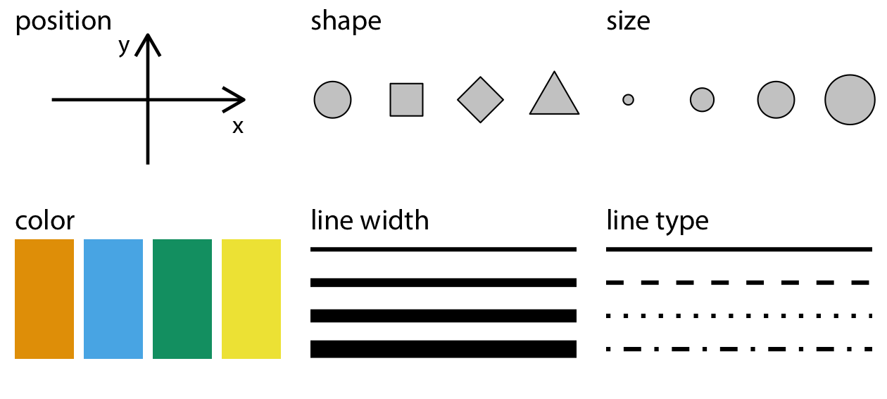
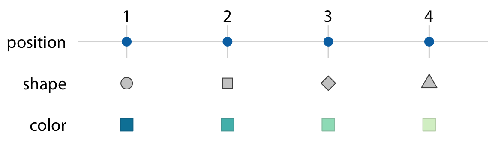
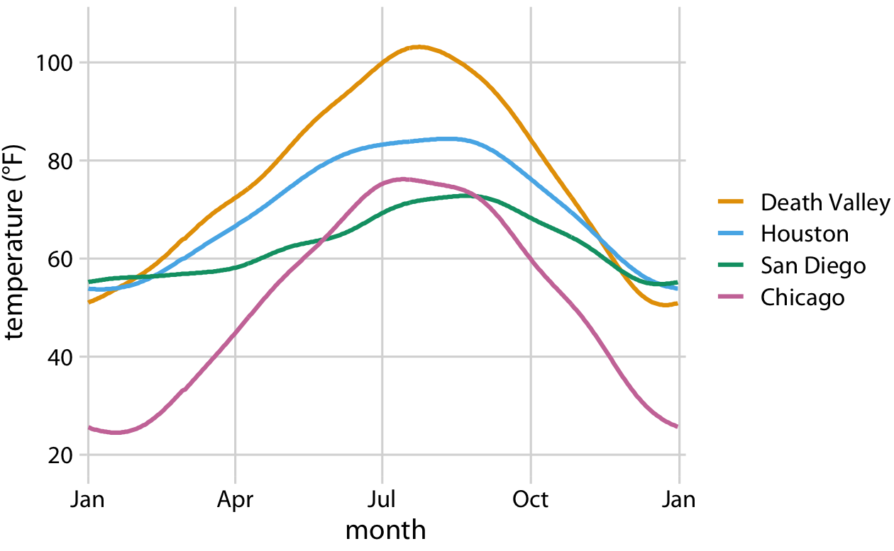
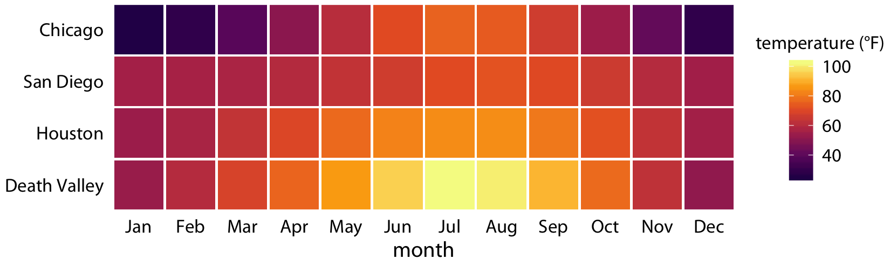
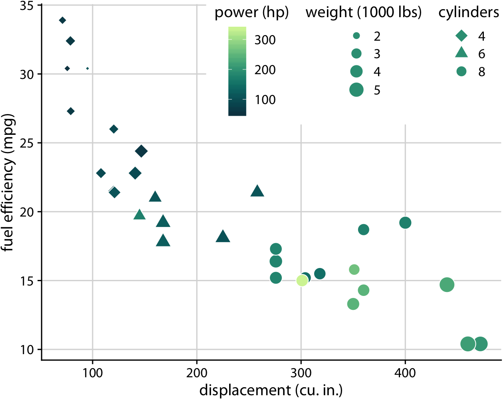

```
## Warning: package 'dplyr' was built under R version 3.5.2
```


# (PART\*) Part I: From data to visualization {-}


# Visualizing data: Mapping data onto aesthetics {#aesthetic-mapping}

データを可視化する場合、データ値を体系的かつ論理的に変換し、最終的なグラフィックとして表現します。データの可視化にはさまざまな種類があり、散布図、円グラフ、ヒートマップは一見するとあまり共通していないように見えますが、これらの可視化はすべて、データ値がどのように紙の上のインクの塊や画面上の色のついたピクセルに変換されるかを捉える共通の言語で記述することが可能です。重要なのは、次のような点です。すべてのデータ可視化は、データ値を、結果として得られるグラフィックの定量化可能な特徴にマッピングする。私たちは、これらの特徴を「美学」*と呼んでいます。

## Aesthetics and types of data

美学は、与えられたグラフィック要素のあらゆる側面を記述します。いくつかの例を Figure \(fig:common-aesthetics) に示しています。すべてのグラフィック要素の重要なコンポーネントは、もちろん、その要素の位置を記述する *位置* です。標準的な 2 次元グラフィックスでは、位置を *x* と *y* の値で表しますが、他の座標系や 1 次元または 3 次元のビジュアリゼーションも可能です。次に、すべてのグラフィック要素には、「形」「大きさ」「色」がある。たとえ白黒の図面を作成する場合でも、背景が白なら黒、黒なら白というように、グラフィック要素は見えるための色が必要である。また、データを可視化するために線を使用する場合、線の幅や点線のパターンが異なる場合があります。Figure \(fig:common-aesthetics) に示した例以外にも、データの可視化で遭遇する美学は数多くあります。例えば、テキストを表示する場合、フォントファミリー、フォントフェイス、フォントサイズを指定する必要がありますし、グラフィックオブジェクトが重なる場合、それらを部分的に透過させるかどうかを指定する必要があります。

(ref:common-aesthetics) データ可視化で一般的に使用される美学：位置、形状、サイズ、色、線幅、線型。これらの美学には，連続データと離散データの両方を表現できるもの（位置，サイズ，線幅，色）と，通常は離散データのみを表現できるもの（形状，線種）がある．

<div class="figure" style="text-align: center">

<p class="caption">(\#fig:common-aesthetics)(ref:common-aesthetics)</p>
</div>


All aesthetics fall into one of two groups: Those that can represent continuous data and those that can not. Continuous data values are values for which arbitrarily fine intermediates exist. For example, time duration is a continuous value. Between any two durations, say 50 seconds and 51 seconds, there are arbitrarily many intermediates, such as 50.5 seconds, 50.51 seconds, 50.50001 seconds, and so on. By contrast, number of persons in a room is a discrete value. A room can hold 5 persons or 6, but not 5.5. For the examples in Figure \@ref(fig:common-aesthetics), position, size, color, and line width can represent continuous data, but shape and line type can usually only represent discrete data.

Next we'll consider the types of data we may want to represent in our visualization. You may think of data as numbers, but numerical values are only two out of several types of data we may encounter. In addition to continuous and discrete numerical values, data can come in the form of discrete categories, in the form of dates or times, and as text (Table \@ref(tab:basic-data-types)). When data is numerical we also call it *quantitative* and when it is categorical we call it *qualitative*. Variables holding qualitative data are *factors*, and the different categories are called *levels*. The levels of a factor are most commonly without order (as in the example of "dog", "cat", "fish" in Table \@ref(tab:basic-data-types)), but factors can also be ordered, when there is an intrinsic order among the levels of the factor (as in the example of "good", "fair", "poor" in Table \@ref(tab:basic-data-types)).

Table: (\#tab:basic-data-types) Types of variables encountered in typical data visualization scenarios.

---------------------------------------------------------------------------------------------------------------------
Type of variable         Examples              Appropriate scale       Description
------------------------ --------------------- ----------------------- ----------------------------------------------
quantitative/numerical   1.3, 5.7, 83,         continuous              Arbitrary numerical values. These can be
continuous               1.5x10^-2^                                    integers, rational numbers, or real numbers.
 
quantitative/numerical   1, 2, 3, 4            discrete                Numbers in discrete units. These are most
discrete                                                               commonly but not necessarily integers.
                                                                       For example, the numbers 0.5, 1.0, 1.5 could
                                                                       also be treated as discrete if intermediate
                                                                       values cannot exist in the given dataset.
 
qualitative/categorical  dog, cat, fish        discrete                Categories without order. These are discrete
unordered                                                              and unique categories that have no inherent
                                                                       order. These variables are
                                                                       also called *factors*.
                                                                       
qualitative/categorical  good, fair, poor      discrete                Categories with order. These are discrete
ordered                                                                and unique categories with an order. For
                                                                       example, "fair" always lies between "good"
                                                                       and "poor". These variables are
                                                                       also called *ordered factors*.

date or time             Jan. 5 2018, 8:03am   continuous or discrete  Specific days and/or times. Also
                                                                       generic dates, such as July 4 or Dec. 25
                                                                       (without year).

text                     The quick brown fox   none, or discrete       Free-form text. Can be treated
                         jumps over the lazy                           as categorical if needed.
                         dog.
---------------------------------------------------------------------------------------------------------------------

To examine a concrete example of these various types of data, take a look at Table \@ref(tab:data-example). It shows the first few rows of a dataset providing the daily temperature normals (average daily temperatures over a 30-year window) for four U.S. locations. This table contains five variables: month, day, location, station ID, and temperature (in degrees Fahrenheit). Month is an ordered factor, day is a discrete numerical value, location is an unordered factor, station ID is similarly an unordered factor, and temperature is a continuous numerical value.

Table: (\#tab:data-example) First 12 rows of a dataset listing daily temperature normals for four weather stations. Data source: NOAA.

 Month   Day  Location      Station ID   Temperature
------- ----- ------------ ------------ -------------
  Jan     1   Chicago      USW00014819        25.6
  Jan     1   San Diego    USW00093107        55.2
  Jan     1   Houston      USW00012918        53.9
  Jan     1   Death Valley USC00042319        51.0
  Jan     2   Chicago      USW00014819        25.5
  Jan     2   San Diego    USW00093107        55.3
  Jan     2   Houston      USW00012918        53.8
  Jan     2   Death Valley USC00042319        51.2
  Jan     3   Chicago      USW00014819        25.3
  Jan     3   San Diego    USW00093107        55.3
  Jan     3   Death Valley USC00042319        51.3
  Jan     3   Houston      USW00012918        53.8


## Scales map data values onto aesthetics

To map data values onto aesthetics, we need to specify which data values correspond to which specific aesthetics values. For example, if our graphic has an *x* axis, then we need to specify which data values fall onto particular positions along this axis. Similarly, we may need to specify which data values are represented by particular shapes or colors. This mapping between data values and aesthetics values is created via *scales*. A scale defines a unique mapping between data and aesthetics (Figure \@ref(fig:basic-scales-example)). Importantly, a scale must be one-to-one, such that for each specific data value there is exactly one aesthetics value and vice versa. If a scale isn't one-to-one, then the data visualization becomes ambiguous.

(ref:basic-scales-example) Scales link data values to aesthetics. Here, the numbers 1 through 4 have been mapped onto a position scale, a shape scale, and a color scale. For each scale, each number corresponds to a unique position, shape, or color and vice versa.

<div class="figure" style="text-align: center">

<p class="caption">(\#fig:basic-scales-example)(ref:basic-scales-example)</p>
</div>

Let's put things into practice. We can take the dataset shown in Table \@ref(tab:data-example), map temperature onto the *y* axis, day of the year onto the *x* axis, location onto color, and visualize these aesthetics with solid lines. The result is a standard line plot showing the temperature normals at the four locations as they change during the year (Figure 
\@ref(fig:temp-normals-vs-time)).

(ref:temp-normals-vs-time) Daily temperature normals for four selected locations in the U.S. Temperature is mapped to the *y* axis, day of the year to the *x* axis, and location to line color. Data source: NOAA.

<div class="figure" style="text-align: center">

<p class="caption">(\#fig:temp-normals-vs-time)(ref:temp-normals-vs-time)</p>
</div>

Figure \@ref(fig:temp-normals-vs-time) is a fairly standard visualization for a temperature curve and likely the visualization most data scientists would intuitively choose first. However, it is up to us which variables we map onto which scales. For example, instead of mapping temperature onto the *y* axis and location onto color, we can do the opposite. Because now the key variable of interest (temperature) is shown as color, we need to show sufficiently large colored areas for the color to convey useful information [@Stone_et_al_2014]. Therefore, for this visualization I have chosen squares instead of lines, one for each month and location, and I have colored them by the average temperature normal for each month (Figure \@ref(fig:four-locations-temps-by-month)).

(ref:four-locations-temps-by-month) Monthly normal mean temperatures for four locations in the U.S. Data source: NOAA 

<div class="figure" style="text-align: center">

<p class="caption">(\#fig:four-locations-temps-by-month)(ref:four-locations-temps-by-month)</p>
</div>

I would like to emphasize that Figure \@ref(fig:four-locations-temps-by-month) uses two position scales (month along the *x* axis and location along the *y* axis) but neither is a continuous scale. Month is an ordered factor with 12 levels and location is an unordered factor with four levels. Therefore, the two position scales are both discrete. For discrete position scales, we generally place the different levels of the factor at an equal spacing along the axis. If the factor is ordered (as is here the case for month), then the levels need to placed in the appropriate order. If the factor is unordered (as is here the case for location), then the order is arbitrary, and we can choose any order we want. I have ordered the locations from overall coldest (Chicago) to overall hottest (Death Valley) to generate a pleasant staggering of colors. However, I could have chosen any other order and the figure would have been equally valid.

Both Figures \@ref(fig:temp-normals-vs-time) and \@ref(fig:four-locations-temps-by-month) used three scales in total, two position scales and one color scale. This is a typical number of scales for a basic visualization, but we can use more than three scales at once. Figure \@ref(fig:mtcars-five-scale) uses five scales, two position scales, one color scale, one size scale, and one shape scale, and all scales represent a different variable from the dataset.


(ref:mtcars-five-scale) Fuel efficiency versus displacement, for 32 cars (1973--74 models). This figure uses five separate scales to represent data: (i) the *x* axis (displacement); (ii) the *y* axis (fuel efficiency); (iii) the color of the data points (power); (iv) the size of the data points (weight); and (v) the shape of the data points (number of cylinders). Four of the five variables displayed (displacement, fuel efficiency, power, and weight) are numerical continuous. The remaining one (number of cylinders) can be considered to be either numerical discrete or qualitative ordered. Data source: *Motor Trend*, 1974.

<div class="figure" style="text-align: center">

<p class="caption">(\#fig:mtcars-five-scale)(ref:mtcars-five-scale)</p>
</div>


