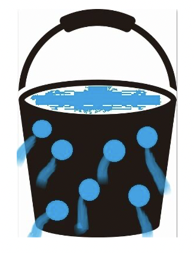

# 記憶するとは？～穴のあいたバケツと認識せよ！～

記憶することは、以下の状態のようなものと認識する。

水を入れてもどんどん水が漏れてしまう、穴の空いたバケツのようなもの。

これが人間の記憶そのものなのです。脳はキャパオーバーにならないように定期的に忘れることによって、機能を保つ働きがあるのです。

そのため、物事を記憶するには工夫する必要があるのです。

# いつ復習するか？～最適の間隔はコレ！～

前節で人は忘れる生き物であるという事がお分かりいただけたでしょうか？つまり、多くの事柄を覚えるには、一度勉強して終わりではなく、必ず復習をする事が重要なわけです。ではいつ復習するのが良いのか？大学受験や資格試験など年単位で記憶を保持しなければならない場合、復習の頻度は最低3回です。間隔は

翌日、1週間後、1か月後

これが最低ラインです。特に翌日の復習は必須です。翌日に復習し忘れた場合、勉強した内容の74％が完全に消えてなくなってしまうからです。これは非常にもったいないです。そして翌日に復習した場合、1週間程度は記憶が持続します。そこで復習するとさらに記憶は強固なものとなり、次の1ヶ月までは記憶の持続期間が延びます。最後に1か月後の復習をする事で年間を通して持続できる記憶へと変化します。また、試験が1か月後や2か月後の短期決戦の場合は

翌日、2日後、3日後

で復習すると試験では良い結果を残せるはずです。とにかく何度も復習する癖を付ける事が重要です。一生懸命勉強しているのに、成績が上がらない生徒ほど復習する習慣がないことに原因があります。

# 睡眠の重要性について～徹夜はNG！～

よく試験の前日に徹夜で勉強する人がいますが、あれはやめた方が良いです。アメリカの心理学者J・G・ジェンキンズとK・M・ダレンバッックは、学習後に睡眠をとった場合とそうでなかった場合の記憶の違いを研究していますし、ハーバード大学のロバート・スティックゴールド博士は学習した日に6時間以上の睡眠をとらないと、記憶として定着しにくいという研究結果を発表しています。

つまり、勉強後に睡眠をとる事の重要性が科学的に証明されている訳なのです。よってあえて非科学的な手法を行う必要はありません。ちなみに私の知人の医大生で同棲をしているカップルがいました。男性は成績上位20番以内、女性は成績下位20番以内でした。医大生最大の難関である医師国家試験に臨むに当たって、男性は前日は21時には勉強を終え、22時には就寝しました。一方、女性の方は何と朝4時までほとんど徹夜で勉強して試験に臨みました。

結果は男性合格、女性不合格

でした。あくまでこれは一例にしかすぎませんが、試験に対する望み方の参考にはなるでしょう。

# 教材の選び方～先達はあらまほしきことなり～

成績下位の人に良くありがちなのが、試験勉強をするにあたって

授業の教科書をそのまま使う！

です。そして多くの人たちがこの間違った方法を続けています。授業の教科書は量も多く、非常に分かりづらいです。そのため、学校で指定された教科書をそのまま使っても理解できないだけでなく、ページ数も多くてほとんど消化不良で終わってしまいます。では成績優秀者が行っているのは何かというと
学年トップクラスの人のノートをコピーする

です。頭の良い人のノートは非常に整理され、誰が見ても分かるようにできています。時間のない中、分厚い教科書を見る必要はありません。頭の良い人にまさる教材はないのです。また、さらに追加する教材としては

先輩の勧める参考書を使用するです。

「先達はあらまほしきことなり」という一文が徒然草にもありましたが、何事も実際に経験した人に聞くのが一番です。分かりにくい学校指定の教科書ではなく、先輩たちが苦労して見つけてきた参考書に勝るものはありません。ぜひとも先輩たちの知恵を借りましょう。これはあらゆる試験にも通用する考えだと思います。大学受験でも学校の教科書で勉強している人はいませんよね。また、試験前にきれいなノートが出回る事ってありますよね。変なプライドを捨て、何年も受験生に愛されている教材や他人のノートの恩恵にあずかることを推奨します。

# マーカーの使い方～絶対やってはいけないサンバカーニバル！～

よく教材購入後、すぐにマーカーを引く人っていませんか？教科書がマーカーだらけでまるで教科書が持ち歩くサンバカーニバルみたいになっている人はいませんか？教科書がマーカーだらけの人は99.9％成績が悪いです。

なぜなら大事なところが分からない！

からです。成績が優秀な人ほど教科書はきれいです。そして本当に重要な所にだけマーカーが引かれているのです。一度成績が5番以内の知人の教材を見せてもらったことがあるのですが、彼はマーカーではなく、ボールペンで重要な所を引いていました。それも赤と青の2色だけです。彼に聞くと

赤・・・実際に試験で出た所
青・・・今後試験に出そうな所

このように色分けしているそうです。そのため余裕のある時は青まで見直し、時間のない直前は赤の部分だけを見直しするようにしているとの事です。つまり、成績が優秀な人というのは、頭の良し悪しではなく、自分の記憶力の限界を把握し、覚えるべき項目に優先順位を付けている人なのです。

# その1 WHY追求法

覚えなければいけない事柄が出てきた時、あなたはいつもどうしていますか？

・書いて覚える
・声に出して覚える
・問題を解きながら覚える

等々いくつかあるかと思います。しかし、医学部の成績上位者は違います。いきなり覚えるのではなく、事柄をじっくり理解することに努めるのです。教科書だけで分かりにくければ、他の参考書、ネット、人に聞く等などしっかり理解する事を最優先しています。
例えば頭部外傷に「急性硬膜外血腫」と「急性硬膜下血腫」という2種類のややこしい疾患があります。頭部CTではそれぞれ「レンズ状」、「三日月型」の出血の特徴があるのですが、成績の振るわない人ほど、これをいきなり覚えようとします。

ところが、成績優秀者は、「なぜレンズ状なのか？」「なぜ三日月型なのか？」を考え、「ああ、硬膜の外の出血だから血流が内側に流れ込んでレンズ状になり、硬膜の下だから血流が周囲に広がって三日月型になるのね」と論理的に考えます。すると、本番でどっちがどっちか分からなくなっても理屈で思い出すことができ、なおかつ有限である記憶の容量を無駄に消費しないのです。

これは成績上位者であるM君に教わった方法です。教わったというより、M君はみんなで勉強している時もほとんど書かずに教科書を読みこんでいたのを疑問に思い、私から尋ねました。理由を聞いて感心した私にM君は笑って
「俺だってたまには書いて覚えるよ」
と言っていましたが、6年間で彼が書いて覚えているのは一度も見たことがありませんでした。